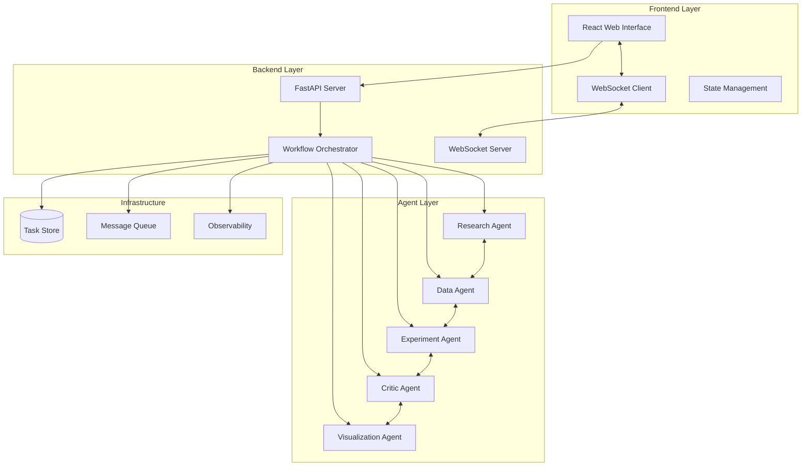
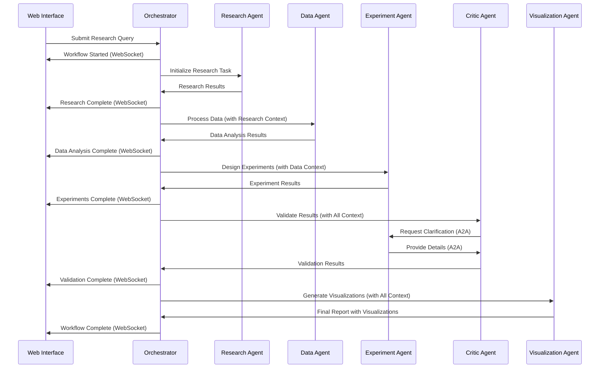

# Design Document

## Overview

Quanta is a modern web-based multi-agent research system built on the Strands SDK that orchestrates five specialized AI agents (Research, Data, Experiment, Critic, Visualization) to conduct comprehensive research workflows. The system features a sleek React-based frontend with real-time progress monitoring and a Python backend leveraging Strands Agent-to-Agent (A2A) communication patterns for seamless agent collaboration.

### Key Design Principles

- **Test-Driven Development**: All components developed with tests first
- **Modular Architecture**: Each increment provides standalone, shippable value
- **Real-time Feedback**: Live progress updates and visual confirmation of all operations
- **Agent Transparency**: Full visibility into agent processes and communications
- **Cloud-Agnostic**: Deployable across multiple cloud providers using Strands abstractions

## Architecture

### High-Level System Architecture



### Agent Communication Flow



## Components and Interfaces

### Frontend Components

#### 1. Research Query Interface
- **Purpose**: Accept user research queries and display submission feedback
- **Key Features**: 
  - Modern form design with validation
  - Query history and suggestions
  - Visual submission confirmation
- **Testing Points**: Form validation, submission success states

#### 2. Real-time Progress Dashboard
- **Purpose**: Display live workflow progress and agent status
- **Key Features**:
  - Agent status indicators (idle, processing, complete)
  - Progress bars for each workflow stage
  - Real-time updates via WebSocket
- **Testing Points**: Status updates, progress animations, WebSocket connectivity

#### 3. Agent Communication Viewer
- **Purpose**: Show transparent agent processes and A2A communications
- **Key Features**:
  - Conversation history for each agent
  - A2A message flow visualization
  - Tool execution logs
- **Testing Points**: Message display, communication flow visualization

#### 4. Results Visualization Panel
- **Purpose**: Display research results, charts, and final reports
- **Key Features**:
  - Interactive charts and graphs
  - Downloadable reports
  - Result filtering and search
- **Testing Points**: Chart rendering, download functionality, data display

### Backend Components

#### 1. FastAPI Application Server
- **Purpose**: Handle HTTP requests and WebSocket connections
- **Key Features**:
  - RESTful API endpoints for research queries
  - WebSocket server for real-time updates
  - Request validation and error handling
- **Interfaces**:
  ```python
  @app.post("/api/research/submit")
  async def submit_research_query(query: ResearchQuery) -> WorkflowResponse
  
  @app.websocket("/ws/{client_id}")
  async def websocket_endpoint(websocket: WebSocket, client_id: str)
  ```

#### 2. Workflow Orchestrator
- **Purpose**: Coordinate agent execution using Strands workflow patterns
- **Key Features**:
  - Sequential and parallel task execution
  - Context passing between agents
  - Error handling and recovery
- **Interfaces**:
  ```python
  class WorkflowOrchestrator:
      async def execute_research_workflow(self, query: str) -> WorkflowResult
      async def get_workflow_status(self, workflow_id: str) -> WorkflowStatus
      async def pause_workflow(self, workflow_id: str) -> bool
  ```

#### 3. Agent Factory
- **Purpose**: Create and configure specialized Strands agents
- **Key Features**:
  - Agent initialization with specific system prompts
  - Tool assignment for each agent type
  - A2A server setup for inter-agent communication
- **Interfaces**:
  ```python
  class AgentFactory:
      def create_research_agent(self) -> Agent
      def create_data_agent(self) -> Agent
      def create_experiment_agent(self) -> Agent
      def create_critic_agent(self) -> Agent
      def create_visualization_agent(self) -> Agent
  ```

### Agent Specifications

#### 1. Research Agent
- **System Prompt**: "You are a research specialist focused on discovering relevant data sources and research information."
- **Tools**: 
  - Web search for data sources and APIs
  - Data source validation and URL extraction
  - Research paper and dataset discovery
  - Text summarization of findings
  - Data source recommendation system
- **A2A Capabilities**: Provides discovered data sources, URLs, and research context to Data Agent

#### 2. Data Agent
- **System Prompt**: "You fetch and process data from sources discovered by the Research Agent, extracting key insights and patterns."
- **Tools**: 
  - Data fetching from URLs provided by Research Agent
  - API integration using endpoints discovered during research
  - CSV/JSON processing from research-identified sources
  - Basic statistical calculations (mean, median, std) on fetched data
  - Data validation and cleaning for research-sourced data
  - Data format conversion and standardization
- **A2A Capabilities**: Receives data sources from Research Agent and shares processed data with Experiment and Critic agents

#### 3. Experiment Agent
- **System Prompt**: "You design experiments using real data to test hypotheses and discover insights."
- **Tools**: 
  - Real data subset analysis
  - A/B test simulation on actual datasets
  - Hypothesis testing on real data patterns
  - Correlation analysis and trend detection
  - Statistical significance testing on real data
- **A2A Capabilities**: Collaborates with Critic agent for experiment validation using real results

#### 4. Critic Agent
- **System Prompt**: "You provide critical analysis and validation of research findings using simple evaluation criteria."
- **Tools**: 
  - Basic methodology checklist
  - Simple bias detection rules
  - Result consistency checking
  - Quality scoring system
  - Feedback generation
- **A2A Capabilities**: Requests clarifications from other agents and provides validation scores

#### 5. Visualization Agent
- **System Prompt**: "You create simple charts and reports from research data and findings."
- **Tools**: 
  - Basic chart generation (bar, line, pie charts)
  - Simple HTML report creation
  - JSON to chart data conversion
  - Text-based data tables
  - Summary report templates
- **A2A Capabilities**: Accesses all agent outputs for basic reporting and simple visualizations

## Data Models

### Core Data Structures

```python
from pydantic import BaseModel
from typing import List, Optional, Dict, Any
from enum import Enum

class WorkflowStatus(str, Enum):
    PENDING = "pending"
    RUNNING = "running"
    COMPLETED = "completed"
    FAILED = "failed"
    PAUSED = "paused"

class AgentStatus(str, Enum):
    IDLE = "idle"
    PROCESSING = "processing"
    COMPLETED = "completed"
    ERROR = "error"

class ResearchQuery(BaseModel):
    query: str
    user_id: str
    priority: int = 1
    metadata: Optional[Dict[str, Any]] = None

class AgentTask(BaseModel):
    task_id: str
    agent_type: str
    description: str
    status: AgentStatus
    input_data: Dict[str, Any]
    output_data: Optional[Dict[str, Any]] = None
    dependencies: List[str] = []
    created_at: str
    completed_at: Optional[str] = None

class WorkflowResult(BaseModel):
    workflow_id: str
    status: WorkflowStatus
    tasks: List[AgentTask]
    final_results: Optional[Dict[str, Any]] = None
    error_message: Optional[str] = None
    progress_percentage: float = 0.0

class A2AMessage(BaseModel):
    from_agent: str
    to_agent: str
    message_type: str
    content: Dict[str, Any]
    timestamp: str
```

### Database Schema

```sql
-- Workflows table
CREATE TABLE workflows (
    id UUID PRIMARY KEY,
    user_id VARCHAR(255) NOT NULL,
    query TEXT NOT NULL,
    status VARCHAR(50) NOT NULL,
    created_at TIMESTAMP DEFAULT CURRENT_TIMESTAMP,
    completed_at TIMESTAMP NULL,
    results JSONB NULL
);

-- Tasks table
CREATE TABLE tasks (
    id UUID PRIMARY KEY,
    workflow_id UUID REFERENCES workflows(id),
    agent_type VARCHAR(100) NOT NULL,
    description TEXT NOT NULL,
    status VARCHAR(50) NOT NULL,
    input_data JSONB NOT NULL,
    output_data JSONB NULL,
    created_at TIMESTAMP DEFAULT CURRENT_TIMESTAMP,
    completed_at TIMESTAMP NULL
);

-- A2A Messages table
CREATE TABLE a2a_messages (
    id UUID PRIMARY KEY,
    workflow_id UUID REFERENCES workflows(id),
    from_agent VARCHAR(100) NOT NULL,
    to_agent VARCHAR(100) NOT NULL,
    message_type VARCHAR(100) NOT NULL,
    content JSONB NOT NULL,
    timestamp TIMESTAMP DEFAULT CURRENT_TIMESTAMP
);
```

## Error Handling

### Frontend Error Handling
- **Network Errors**: Retry mechanisms with exponential backoff
- **WebSocket Disconnections**: Automatic reconnection with state recovery
- **Validation Errors**: Real-time form validation with clear error messages
- **UI Errors**: Error boundaries with graceful fallbacks

### Backend Error Handling
- **Agent Failures**: Automatic retry with circuit breaker pattern
- **Workflow Errors**: Pause and recovery mechanisms
- **A2A Communication Errors**: Fallback to direct agent calls
- **Database Errors**: Connection pooling with retry logic

### Error Recovery Strategies
```python
class ErrorRecoveryManager:
    async def handle_agent_failure(self, agent_id: str, error: Exception):
        # Implement retry logic with exponential backoff
        # Log error for observability
        # Notify frontend of failure and recovery attempts
        
    async def handle_workflow_failure(self, workflow_id: str, error: Exception):
        # Pause workflow
        # Save current state
        # Notify user of failure
        # Provide recovery options
```

## Testing Strategy

### Frontend Testing
1. **Unit Tests**: Component testing with Jest and React Testing Library
2. **Integration Tests**: API integration and WebSocket communication
3. **Visual Tests**: Screenshot testing for UI consistency
4. **E2E Tests**: Complete user workflows with Playwright

### Backend Testing
1. **Unit Tests**: Individual function and class testing with pytest
2. **Integration Tests**: Agent communication and workflow execution
3. **API Tests**: FastAPI endpoint testing with test client
4. **Load Tests**: Performance testing with multiple concurrent workflows

### Agent Testing
1. **Agent Behavior Tests**: Validate agent responses and tool usage
2. **A2A Communication Tests**: Test inter-agent message passing
3. **Workflow Integration Tests**: End-to-end agent collaboration
4. **Mock Testing**: Test with simulated agent responses

### Test Data Management
```python
# Test fixtures for consistent testing
@pytest.fixture
def sample_research_query():
    return ResearchQuery(
        query="Analyze the impact of AI on scientific research",
        user_id="test_user_123",
        priority=1
    )

@pytest.fixture
def mock_agent_responses():
    return {
        "research": "Literature review completed with 15 relevant papers",
        "data": "Data analysis shows 40% increase in AI adoption",
        "experiment": "Simulation results confirm hypothesis",
        "critic": "Methodology is sound, results are valid",
        "visualization": "Charts and report generated successfully"
    }
```

### Visual Testing Points
Each task implementation will include specific visual confirmation points:
- Form submission success indicators
- Real-time progress updates
- Agent status changes
- Result display and formatting
- Error state presentations
- Loading states and animations